# Affiliate Heaven — Architecture Diagram

> Render this with any Mermaid-compatible viewer (GitHub, Notion, VS Code + Markdown Preview Mermaid, mermaid.live).

```mermaid
flowchart TD
    %% ── External Actors ──
    Browser(["🖥️ Browser\n(Hebrew RTL UI)"])
    GoogleOAuth(["🔑 Google OAuth 2.0"])
    CronJob(["⏰ node-cron\nScheduler"])

    %% ── Express Server ──
    subgraph SERVER["Express.js — server.js"]
        Session["Passport Session\n(30-day cookie)"]
        SSE["SSE Log Stream\n/api/logs"]
    end

    %% ── Route Layer ──
    subgraph ROUTES["Routes"]
        R_Products["/api/products"]
        R_Subjects["/api/subjects"]
        R_Schedules["/api/schedules"]
        R_Send["/api/send"]
        R_Broadcasts["/api/broadcasts"]
        R_Analytics["/api/analytics"]
        R_Scrape["/api/scrape"]
        R_AliAPI["/api/aliexpress"]
        R_Facebook["/api/facebook"]
        R_Prompt["/api/prompt"]
        R_Users["/api/users"]
        R_WASvc["/api/whatsapp-service"]
    end

    %% ── Service Layer ──
    subgraph SERVICES["Services"]
        S_Workflow["workflow.js\n(send pipeline)"]
        S_OpenAI["openai.js\n(Hebrew message gen)"]
        S_WhatsApp["whatsapp.js\n(dual provider)"]
        S_Facebook["facebook.js\n(Graph API)"]
        S_Instagram["instagram.js\n(Content API)"]
        S_BroadcastDel["broadcastDelivery.js"]
        S_BroadcastSvc["broadcastService.js\n(CRUD + recurrence)"]
        S_SubjectSvc["subjectService.js\n(niches + WA groups)"]
        S_UserSvc["userService.js\n(60s TTL cache)"]
        S_InviteSvc["inviteService.js\n(token lifecycle)"]
        S_Sheets["googleSheets.js\n(legacy sync)"]
        S_SpooMe["spooMe.js\n(URL shortening)"]
        S_AliAPI["aliexpressApi.js\n(OAuth signing)"]
        S_Prompt["promptStore.js\n(in-memory prompt)"]
        S_Scraper["scrapers/aliexpress.js\n(Playwright)"]
    end

    %% ── Databases ──
    subgraph DATABASES["Databases"]
        PG[("🐘 PostgreSQL\nusers · invitations\nsubjects · whatsapp_groups\nproducts · schedules\nbroadcast_messages\nlogs · settings\ncommission_snapshots\norder_items · ad_spend\npost_insights\njoin_link_click_snapshots")]
        Sheets[("📊 Google Sheets\nProducts tab\nSettings tab\nLogs tab (append-only)")]
    end

    %% ── External APIs ──
    subgraph EXTERNAL["External APIs"]
        EXT_OpenAI["🤖 OpenAI API\ngpt-4.1-mini"]
        EXT_Facebook["📘 Facebook\nGraph API v23"]
        EXT_Instagram["📸 Instagram\nContent Publishing API"]
        EXT_Macro["📱 MacroDroid\nWebhook (Android)"]
        EXT_WebJS["💬 whatsapp-web.js\nMicroservice"]
        EXT_AliExpress["🛒 AliExpress\nAffiliate API"]
        EXT_SpooMe["🔗 spoo.me\nURL Shortener"]
        EXT_GoogleSheets["📄 Google Sheets API\n(Service Account)"]
    end

    %% ── Browser → Server ──
    Browser -->|"HTTP / REST"| SERVER
    Browser -->|"SSE (log stream)"| SSE
    Browser -->|"Google OAuth"| GoogleOAuth
    GoogleOAuth -->|"callback"| Session

    %% ── Server → Routes ──
    SERVER --> ROUTES

    %% ── Routes → Services ──
    R_Products --> S_SubjectSvc
    R_Products --> S_SpooMe
    R_Subjects --> S_SubjectSvc
    R_Schedules --> CronJob
    R_Send --> S_Workflow
    R_Broadcasts --> S_BroadcastSvc
    R_Broadcasts --> S_BroadcastDel
    R_Analytics --> S_AliAPI
    R_Scrape --> S_Scraper
    R_AliAPI --> S_AliAPI
    R_Facebook --> S_Facebook
    R_Prompt --> S_Prompt
    R_Users --> S_UserSvc
    R_Users --> S_InviteSvc
    R_WASvc --> EXT_WebJS

    %% ── Scheduler → Services ──
    CronJob -->|"fire product schedule"| S_Workflow
    CronJob -->|"fire broadcast"| S_BroadcastDel

    %% ── Workflow pipeline ──
    S_Workflow --> S_OpenAI
    S_Workflow --> S_WhatsApp
    S_Workflow --> S_Facebook
    S_Workflow --> S_Instagram
    S_Workflow --> S_Sheets

    %% ── Broadcast pipeline ──
    S_BroadcastDel --> S_WhatsApp
    S_BroadcastDel --> S_Facebook

    %% ── WhatsApp dual provider ──
    S_WhatsApp -->|"provider: macrodroid"| EXT_Macro
    S_WhatsApp -->|"provider: webjs"| EXT_WebJS

    %% ── OpenAI ──
    S_OpenAI --> EXT_OpenAI

    %% ── Facebook / Instagram ──
    S_Facebook --> EXT_Facebook
    S_Instagram --> EXT_Instagram

    %% ── AliExpress ──
    S_AliAPI --> EXT_AliExpress
    S_Scraper --> EXT_AliExpress

    %% ── URL Shortening ──
    S_SpooMe --> EXT_SpooMe

    %% ── Database reads/writes ──
    S_Workflow -->|"read/write products"| PG
    S_BroadcastSvc -->|"CRUD"| PG
    S_SubjectSvc -->|"CRUD"| PG
    S_UserSvc -->|"CRUD"| PG
    S_InviteSvc -->|"CRUD"| PG
    S_Sheets -->|"sync/log"| Sheets
    Sheets -->|"Sheets API"| EXT_GoogleSheets
    S_Prompt -->|"fallback read"| PG

    %% ── Styles ──
    classDef external fill:#2d4a6b,stroke:#5b9bd5,color:#fff
    classDef service fill:#2d4a3e,stroke:#5baa72,color:#fff
    classDef route fill:#4a3a2d,stroke:#c8a05b,color:#fff
    classDef db fill:#4a2d3a,stroke:#c05b8a,color:#fff
    classDef server fill:#3a2d4a,stroke:#9b5bc8,color:#fff
    classDef actor fill:#1a1a2e,stroke:#888,color:#fff

    class EXT_OpenAI,EXT_Facebook,EXT_Instagram,EXT_Macro,EXT_WebJS,EXT_AliExpress,EXT_SpooMe,EXT_GoogleSheets external
    class S_Workflow,S_OpenAI,S_WhatsApp,S_Facebook,S_Instagram,S_BroadcastDel,S_BroadcastSvc,S_SubjectSvc,S_UserSvc,S_InviteSvc,S_Sheets,S_SpooMe,S_AliAPI,S_Prompt,S_Scraper service
    class R_Products,R_Subjects,R_Schedules,R_Send,R_Broadcasts,R_Analytics,R_Scrape,R_AliAPI,R_Facebook,R_Prompt,R_Users,R_WASvc route
    class PG,Sheets db
    class SERVER,Session,SSE server
    class Browser,GoogleOAuth,CronJob actor
```



---

## OpenAI Image Generation Prompt

If you cannot render Mermaid, paste the following into **ChatGPT / DALL-E 3 / Midjourney**:

```
A clean, professional software architecture diagram for a Node.js SaaS application called "Affiliate Heaven".
Dark background (#0d1117), neon accent lines. Monospace font labels.

Layout: left-to-right flow with 5 vertical swim lanes:

LANE 1 — ACTORS (dark blue boxes):
- Browser (Hebrew RTL UI)
- node-cron Scheduler
- Google OAuth 2.0

LANE 2 — EXPRESS SERVER + ROUTES (purple boxes):
Express.js server.js at top, then route boxes below:
/api/products, /api/subjects, /api/schedules, /api/send, /api/broadcasts,
/api/analytics, /api/scrape, /api/aliexpress, /api/facebook, /api/prompt,
/api/users, /api/whatsapp-service

LANE 3 — SERVICES (green boxes):
workflow.js, openai.js, whatsapp.js, facebook.js, instagram.js,
broadcastDelivery.js, broadcastService.js, subjectService.js,
userService.js, inviteService.js, googleSheets.js, spooMe.js,
aliexpressApi.js, promptStore.js, scrapers/aliexpress.js

LANE 4 — DATABASES (pink cylinder icons):
PostgreSQL (tables: users, products, subjects, schedules, broadcast_messages, logs, commissions)
Google Sheets (tabs: Products, Settings, Logs)

LANE 5 — EXTERNAL APIS (teal boxes):
OpenAI API (gpt-4.1-mini)
Facebook Graph API v23
Instagram Content Publishing API
MacroDroid Webhook
whatsapp-web.js Microservice
AliExpress Affiliate API
spoo.me URL Shortener
Google Sheets API

Arrows: white labeled arrows showing data flow.
Key flows highlighted in bright yellow:
  Browser → Routes → workflow.js → OpenAI → WhatsApp/Facebook/Instagram → PostgreSQL
  node-cron → workflow.js (product send)
  node-cron → broadcastDelivery.js (broadcast send)

Style: dark theme, neon green/blue/purple accent lines, clean grid layout, no decorative elements.
```
